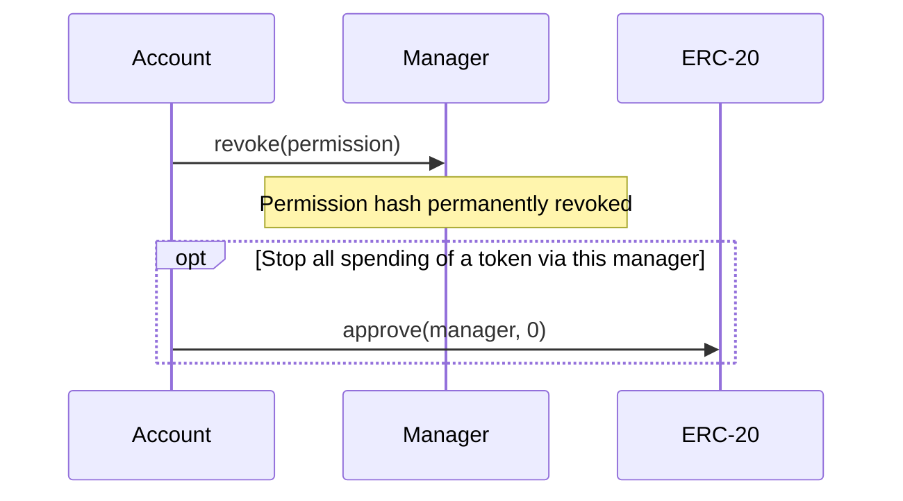

# Allowance-backed permission workflows

## Approve a token, sign, and spend

```mermaid
sequenceDiagram
    participant A as Account
    participant S as Spender
    participant M as Manager
    participant T as ERC-20
    A->>T: approve(manager, tokenAllowance)
    A-->>S: Signed EIP-712 SpendPermission
    S->>M: spendWithSignature(permission, value, signature)
    Note over M: SignatureChecker validates EOA or ERC-1271 signature
    Note over M: Register permission; check caller, revocation, time and budget
    Note over M: Record usage before external transfer
    M->>T: transferFrom(account, spender, value)
    S->>M: spend(permission, nextValue)
    Note over M: Check and update period usage
    M->>T: transferFrom(account, spender, nextValue)
```

Token approval and permission approval are distinct. A signature cannot create a generic ERC-20 allowance for an EOA. A contract wallet executes its ERC-20 approval from its own address through its wallet interface.

An account can register directly using `approve(permission)`, or anyone can submit `approveWithSignature(permission, signature)`. For a batch, the signer approves the EIP-712 `SpendPermissionBatch` digest. Each entry is subsequently spent using its individual permission.

## Revoke



The account can revoke before a signed permission is submitted. A spender can revoke its own permission using `revokeAsSpender`. Restoring token allowance does not reactivate a revoked hash, but does make other still-valid permissions usable again.

See [atomically replacing a permission](diagrams/approveWithRevoke.md) for guarded permission updates.
